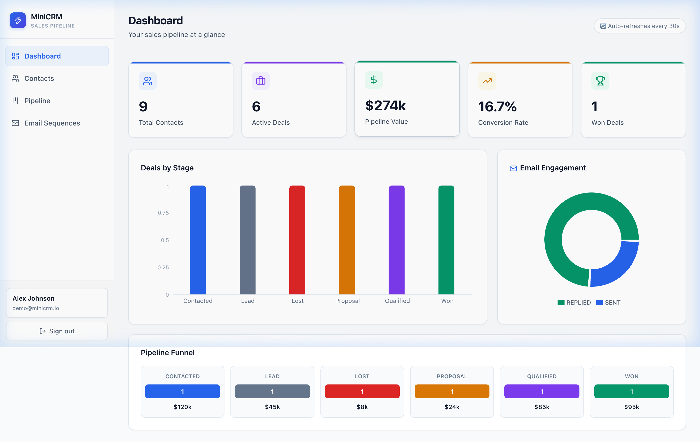
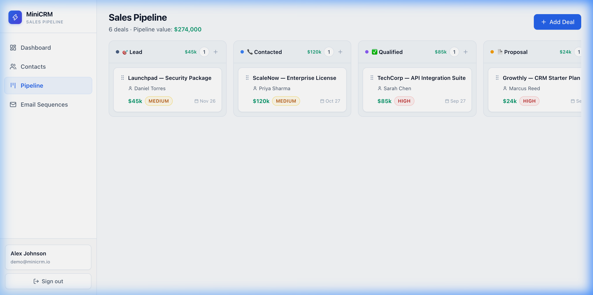
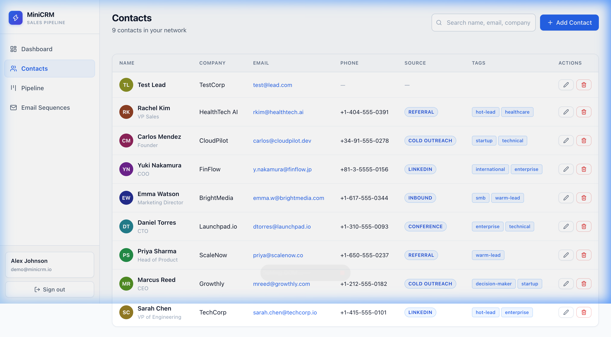
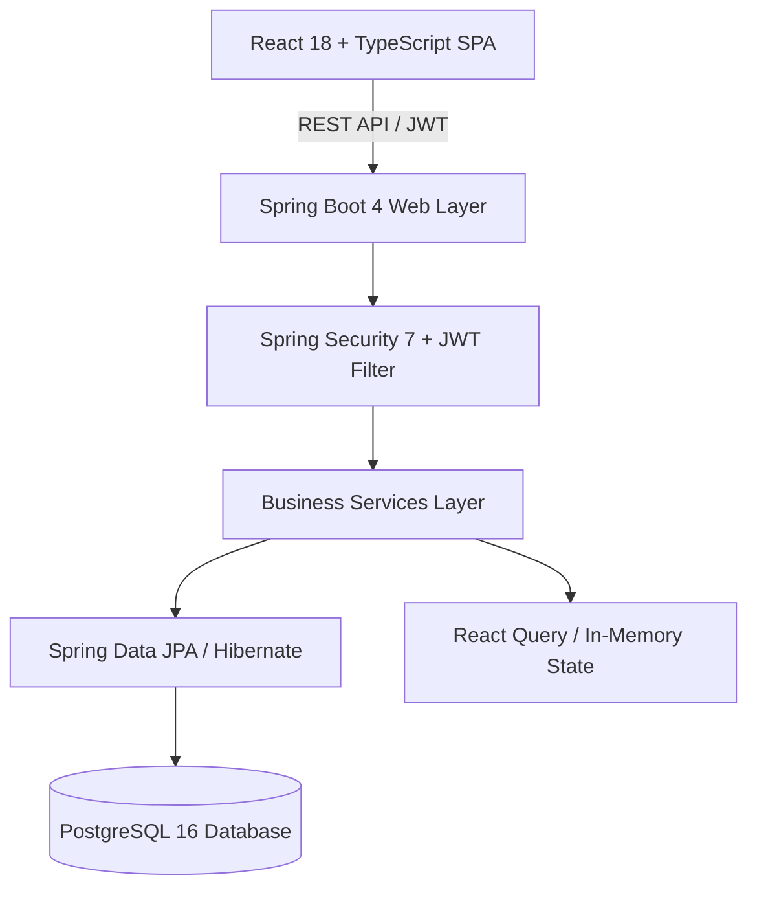

<div align="center">

# ⚡ Nexora CRM — Sales Pipeline & Outreach Manager

**A modern, production-grade Sales Pipeline & CRM Manager built with Spring Boot, PostgreSQL, React 18, and TypeScript.**

[](https://crm-mini-git-main-blackde605-1542.vercel.app/)
[](https://github.com/armin96/CRM2)

<br/>

### 🌐 [👉 Click Here to Open Live Demo (Vercel) 👈](https://crm-mini-git-main-blackde605-1542.vercel.app/)
*(Demo login is pre-filled: `demo@minicrm.io` / `demo1234` — just click **Sign in**)*

<br/>

[](https://github.com/armin96/CRM2/actions)
[](https://openjdk.org/)
[](https://spring.io/projects/spring-boot)
[](https://react.dev/)
[](https://www.typescriptlang.org/)
[](https://www.postgresql.org/)
[](https://www.docker.com/)
[](https://tailwindcss.com/)

</div>

---

## 📸 Screenshots & Visual Overview

### 1. Analytics Dashboard (Real-time KPIs & Conversion Funnels)


### 2. 6-Stage Drag-and-Drop Pipeline (Kanban Board with @dnd-kit)


### 3. Contact & Outreach Management (Multi-field Search & Pagination)


---

## 🎯 Why This Project?

Unlike generic to-do apps or tutorial e-commerce clones, MiniCRM is built around authentic Go-To-Market (GTM) and Full-Stack workflows:
- **Real-world domain model**: Handles real sales velocity, conversion bottlenecks, deal prioritization, and multi-touch email sequencing.
- **Production architectural standards**: Stateless JWT security, Flyway database migrations, Testcontainers for real-database integration tests, and containerized Docker deployments.
- **Enterprise-ready UI/UX**: Minimalist white interface inspired by Linear and Stripe, with zero latency drag-and-drop powered by `@dnd-kit`.

---

## 🏗️ Architecture



```
miniCRM/
├── backend/                  # Spring Boot 4 REST API Service
│   ├── src/main/java/com/minicrm/
│   │   ├── auth/             # JWT Authentication & User Management
│   │   ├── contact/          # Contacts CRUD with Multi-field Search & Pagination
│   │   ├── deal/             # 6-Stage Pipeline Deals & Stage Transitions
│   │   ├── email/            # Outreach Email Sequencing & Engagement Tracker
│   │   ├── dashboard/        # Revenue KPIs & Pipeline Stage Metrics
│   │   ├── common/           # Security Filter Chain, CORS, Global Error Handler
│   │   ├── DataSeeder.java   # Realistic Enterprise Demo Data Seeder
│   │   └── MinicrmApplication.java
│   ├── src/main/resources/
│   │   ├── db/migration/     # Flyway Schema Migrations (V1)
│   │   └── application.yml   # Multi-environment App Configuration
│   └── src/test/             # JUnit 5 + Testcontainers Integration Tests
│
├── frontend/                 # React 18 + TypeScript SPA (Vite)
│   ├── src/
│   │   ├── api/              # Axios Client with Auto-JWT Attachment & Demo Fallback
│   │   ├── components/       # AppLayout, Sidebar, Modal Dialogs, Route Guards
│   │   ├── pages/            # Dashboard, Contacts, Pipeline, Emails, Auth
│   │   ├── store/            # Zustand Client & Auth Store (with LocalStorage Sync)
│   │   ├── types/            # Strict TypeScript Interfaces & Domain Enums
│   │   ├── test/             # Vitest & React Testing Library Test Suites
│   │   └── index.css         # Minimalist White Design System
│   ├── vite.config.ts        # Vite + Tailwind + Test config
│   └── Dockerfile            # Multi-stage Nginx Production Image
│
├── docs/screenshots/         # Application visual previews
├── .github/workflows/        # CI/CD: Automated Maven & NPM Test Pipeline
└── docker-compose.yml        # One-command full-stack container orchestration
```

---

## ✨ Key Features

### 1. 📊 Real-Time Analytics Dashboard
- **5 Core KPI Cards**: Total Contacts, Active Deals, Total Pipeline Value, Win Rate %, Won Deals.
- **Deals by Stage Bar Chart**: Aggregated count & monetary volume per sales stage.
- **Email Engagement Donut Chart**: Live distribution of `SENT`, `OPENED`, `REPLIED`, and `BOUNCED` sequences.
- **Pipeline Funnel**: Visual progression tracking conversion drop-offs.

### 2. 👥 Comprehensive Contact Management
- Full CRUD with instant search across name, company, email, and tags.
- Categorized source attribution (`LinkedIn`, `Cold Outreach`, `Referral`, `Conference`, `Inbound`).
- Clean paginated table with dynamic avatar initials and tag badges.

### 3. 📋 Drag-and-Drop Pipeline (Kanban Board)
- 6 standardized deal stages:
  $$\text{Lead} \longrightarrow \text{Contacted} \longrightarrow \text{Qualified} \longrightarrow \text{Proposal} \longrightarrow \text{Won} / \text{Lost}$$
- Fluid, optimistic drag-and-drop transitions powered by `@dnd-kit`.
- Real-time column metrics recalculating stage value and deal count.

### 4. 📧 Cold Email Sequence Tracker
- Log multi-touch outreach emails linked to specific contacts and deals.
- Instant status transitions (`SENT` $\rightarrow$ `OPENED` $\rightarrow$ `REPLIED` / `BOUNCED`) with automatic timestamp tracking.

### 5. 🔐 Security & Session Management
- Stateless JWT authentication with HMAC SHA-512 cryptographic signing.
- BCrypt salted password hashing.
- Auto-redirect interceptor on expired or invalid tokens.

---

## 🔌 REST API Specification

| Method | Endpoint | Description | Auth Required |
|---|---|---|:---:|
| `POST` | `/api/auth/register` | Register a new user | ❌ |
| `POST` | `/api/auth/login` | Authenticate & receive JWT token | ❌ |
| `GET` | `/api/auth/me` | Retrieve authenticated user profile | ✅ |
| `GET` | `/api/contacts?search=&page=&size=` | Search & paginate contacts | ✅ |
| `POST` | `/api/contacts` | Create a contact with tags & notes | ✅ |
| `PUT` | `/api/contacts/{id}` | Update existing contact | ✅ |
| `DELETE`| `/api/contacts/{id}` | Delete contact (cascades) | ✅ |
| `GET` | `/api/deals/kanban` | Fetch all deals grouped by stage column | ✅ |
| `POST` | `/api/deals` | Create a deal attached to a contact | ✅ |
| `PATCH` | `/api/deals/{id}/stage` | Update deal stage & Kanban position | ✅ |
| `DELETE`| `/api/deals/{id}` | Delete deal | ✅ |
| `GET` | `/api/emails?contactId=&page=` | List outreach logs with status | ✅ |
| `POST` | `/api/emails` | Log an outreach email | ✅ |
| `PATCH` | `/api/emails/{id}/status` | Transition email status (SENT/OPENED/REPLIED) | ✅ |
| `GET` | `/api/dashboard/stats` | Aggregate dashboard KPI metrics | ✅ |

---

## 🧪 Testing Strategy

Both frontend and backend are thoroughly tested:

### Backend (JUnit 5 + Testcontainers)
Integration tests spin up an ephemeral PostgreSQL instance via Docker to test real database queries, Flyway migrations, and Spring Security filters:
```bash
cd backend
mvn verify
```

### Frontend (Vitest + React Testing Library)
Unit and component tests verify Zustand store state mutations, auth guards, and UI rendering:
```bash
cd frontend
npm test
```

---

## 🚀 Quickstart & Local Setup

### Option A: Docker Compose (Fastest)

Clone the repository and run all services (Postgres, Backend, Frontend) with a single command:
```bash
git clone https://github.com/armin96/CRM2.git
cd CRM2
docker-compose up --build
```
- **Frontend App**: `http://localhost:3000`
- **Backend API**: `http://localhost:8080`
- **PostgreSQL**: `localhost:5432`

---

### Option B: Local Development

**Prerequisites:** Java 21+, Maven, Node.js 20+, PostgreSQL 16+

**1. Start PostgreSQL:**
```bash
# Using Docker:
docker run -d --name minicrm-db \
  -e POSTGRES_DB=minicrm \
  -e POSTGRES_USER=minicrm \
  -e POSTGRES_PASSWORD=minicrm \
  -p 5432:5432 postgres:16-alpine
```

**2. Start Backend:**
```bash
cd backend
mvn spring-boot:run
# Server starts on http://localhost:8080
```

**3. Start Frontend:**
```bash
cd frontend
npm install
npm run dev
# App starts on http://localhost:5173
```

---

## 🔑 Pre-seeded Demo Account

The database includes realistic sample data on first boot:
```
Email:    demo@minicrm.io
Password: demo1234
```
*(Pre-filled on the login screen for instant evaluation)*

---

## 🚢 Deployment Guide

| Component | Platform | Configuration |
|---|---|---|
| **Backend API** | Railway / Render | Uses `backend/Dockerfile` (Java 21 JRE Alpine) |
| **Frontend** | Vercel / Netlify | Build command: `npm run build`, Output: `dist` |
| **Database** | Neon / Supabase | Free tier serverless PostgreSQL |

**Environment Variables for Production:**
```env
DB_URL=jdbc:postgresql://<host>:<port>/<dbname>?sslmode=require
DB_USERNAME=<db_user>
DB_PASSWORD=<db_password>
JWT_SECRET=<your-64-character-random-hex-string>
```

---

## 👨‍💻 Author & Creator

**Armin** ([@armin96](https://github.com/armin96))
- **Email:** [devaafy@gmail.com](mailto:devaafy@gmail.com)
- **GitHub:** [github.com/armin96](https://github.com/armin96)

---

## 📄 License

This project is licensed under the MIT License.

